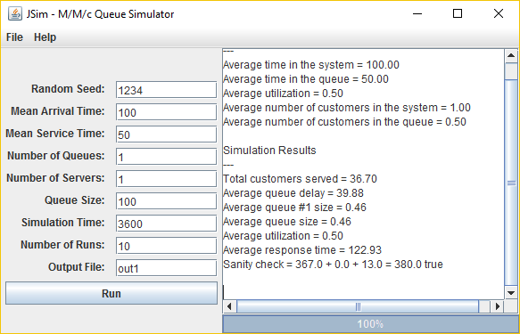

# JSim

JSim is a Java-based discrete event simulator of an M/M/s queue system. The target audience are students and educators who may use it to explain and understand the basic principles of the system.

JSim includes a library of classes that can be used to modify the application to simulate other types of queuing systems as well. Therefore, it may be used as starting point to build larger, application specific simulator.

{ width=6cm }

## Intended Audience
Science/Research, Education, Manufacturing, Telecommunications Industry, End Users/Desktop, Engineering

## How to use?

Clone the code then compile and run JSim. You should get a results similar to below when using the default settings in settings.ini file.

{ width=6cm }

## Developer Documentation

Refer to http://adhocnode.com/jsim-queue-simulator/ to use JSim in your own simulation projects.

## User Interface

Java Swing
